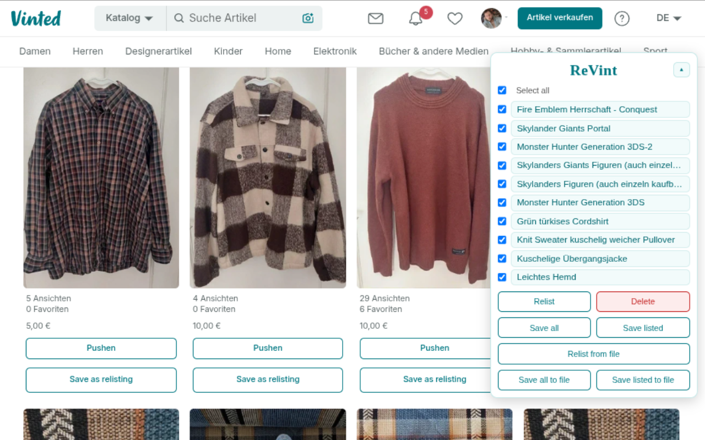

# ReVint

Chromium extension that saves your own Vinted listings locally and refills the sell form in one click.

## What it does

- Saves one of your own listings from your member page — title, description, price, category, size, condition, brand, colour, material, ISBN, platform, age rating and photos.
- Fills the sell form (`/items/new`) from a saved listing.
- Relists several saved items in sequence.
- **Upload & delete**: publishes the new listing and removes the original.
- Works on all Vinted domains, in 22 languages.
- Everything stays on your device.

## Install

1. Open `chrome://extensions` and enable **Developer mode**.
2. Click **Load unpacked** and select this folder.
3. Open Vinted and reload your member page.

## Usage

- Member page: click **Save as relisting** under an item to save it.
- Sell form: open the ReVint panel and click a saved item to fill the form.
- Review the form, then click **Upload & delete** to publish and remove the original.
- Nothing is submitted until you click a button. Unclear fields stay for you to check manually.

## Batch & files

- **Relist** opens the selected items one by one, with a delay between them.
- **Save all** / **Save listed** export every listing (or only the active ones) to the local library.
- **Relist from file** loads a saved `.revint.json` file.

## Limits

- Depends on Vinted's DOM — UI changes can break individual fields.
- Verify size, condition, colour, package size and photos before uploading.

## Privacy

No data leaves your device. ReVint has no server, no analytics and makes no requests of its own. Saved listings (including photos as Base64) live locally in the extension's IndexedDB. See the [privacy policy](docs/privacy-policy.md).

## Disclaimer

Use this only on listings you own. Respect Vinted's Terms of Service. Not affiliated with, endorsed by or connected to Vinted.
